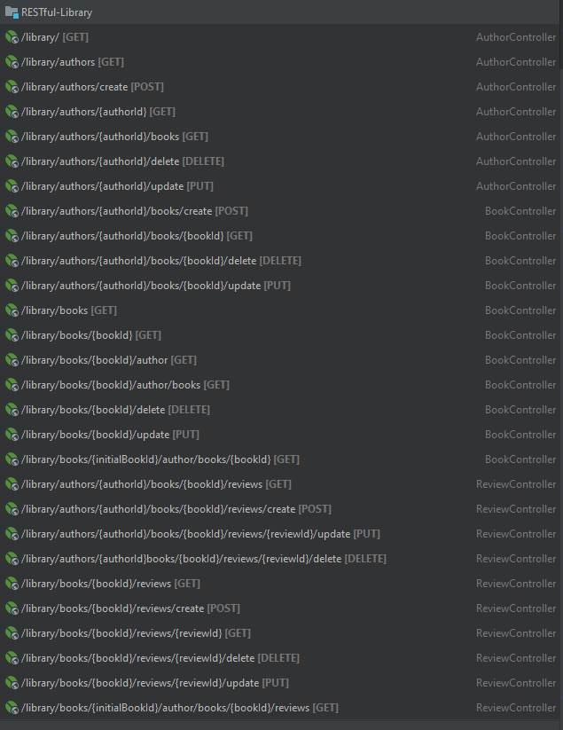

# REST application - Library
#### REST-API fully tested service.
How to set up project:
1) git clone https://github.com/VladMakhov/RESTful-Library
2) In application.properties change database url, username, password and driver (Add dependency if needed)
3) Run LibraryApplication.java class and use Postman or curl to communicate with application through URI`s
4) http://localhost:8080/library/ + check in Endpoints to navigate

# Endpoints

