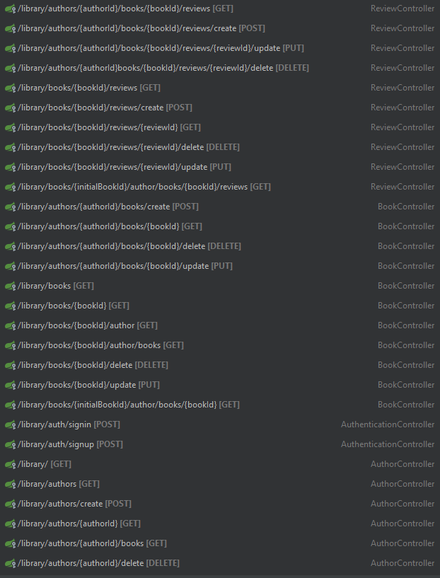

# RESTful service - Library
#### JWT security Registration and Authorization, Unit and Integration tests with Junit5, Mockito and Test containers.
How to set up project:
1) git clone https://github.com/VladMakhov/RESTful-Library
2) In application.properties change database url, username, password and driver (Add dependency if needed)
3) To test application you either need to run test.java or start docker and uncomment test.java.system.config.TestConfig bean to use test container
4) Run LibraryApplication.java
5) Register new user by http://localhost:8080/library/auth/register url and use received token
6) http://localhost:8080/library/ + check in Endpoints to navigate

# Endpoints
